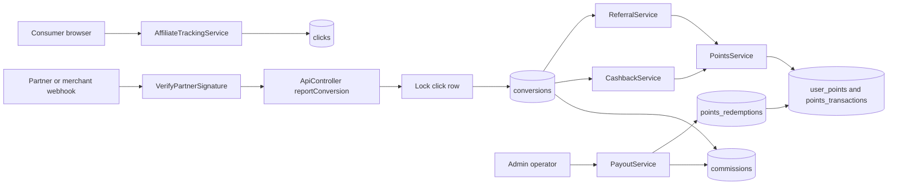

# ZenithSoles Affiliates Architecture

## System boundary

ZenithSoles Affiliates is a Laravel 12 application with Blade-based consumer and admin interfaces, JSON API routes for affiliate and points integrations, an Eloquent persistence layer, and service classes for attribution, cashback, referrals, points-ledger operations, and payouts. MySQL is the production target; SQLite is used for local and feature-test verification.

## Runtime flow

## Control boundaries

The partner signature middleware authenticates mutation requests using a configured key, timestamp window, and HMAC-SHA256 digest over the exact raw request body. Conversion reporting uses `partner_event_id` for at-least-once delivery and locks the attributed click before creating conversion and commission records. Cashback and referral rewards use deterministic ledger idempotency keys derived from the conversion ID.

All wallet and payout transitions are transaction-scoped. `PointsService` locks the user wallet row before balance changes. `PayoutService` coordinates withdrawal creation, commission transitions, redemption transitions, and idempotent rejection refunds. Domain models reject illegal state transitions such as paying an unapproved commission or completing an unapproved redemption.

## Deployment boundary

The application process requires PHP 8.2 or newer, Laravel 12-compatible Composer dependencies, writable runtime directories, and a configured database. Secrets are injected by the deployment environment. Partner adapters, payout-provider clients, GeoIP enrichment, centralized logging, and background workers remain environment-specific integrations and are not represented by fake local implementations.

## Related documents

`PARTNER_INTEGRATION_CONTRACT.md` defines the partner API contract. `API_SECURITY_CONTRACT.md` defines HMAC headers and signing. `docs/RELEASE_OPERATIONS_RUNBOOK.md` defines deployment and rollback operations. `docs/STAGING_ACCEPTANCE_RECORD.md` defines staging evidence and sign-off.
